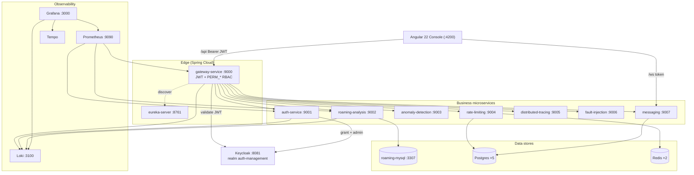
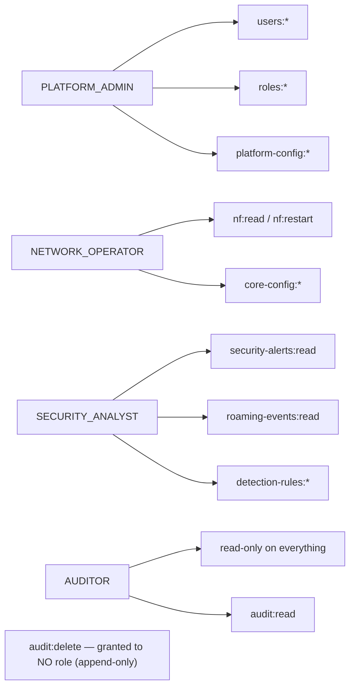
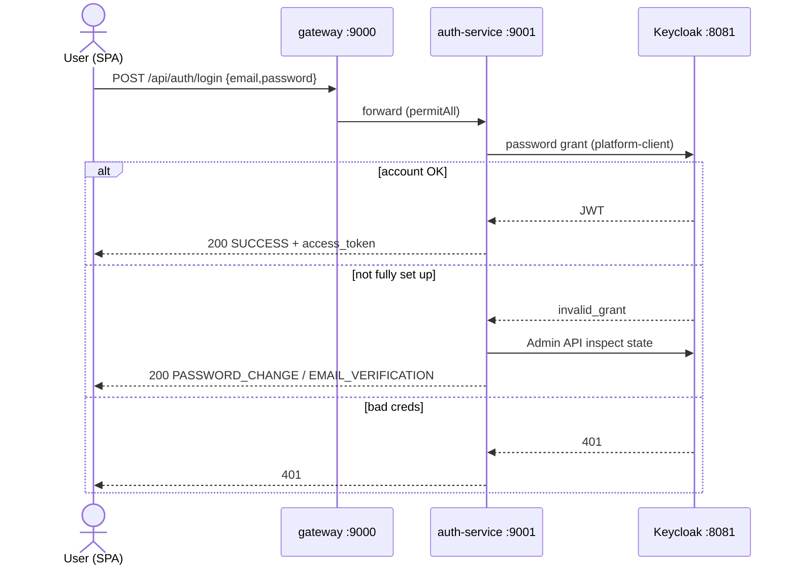
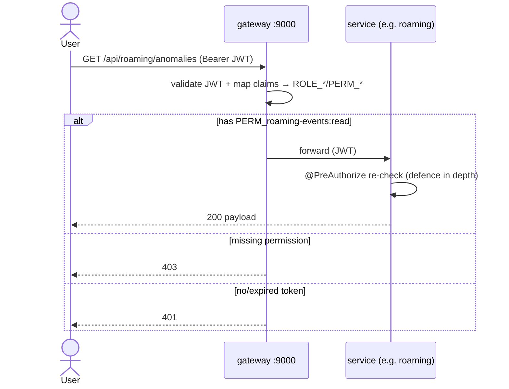
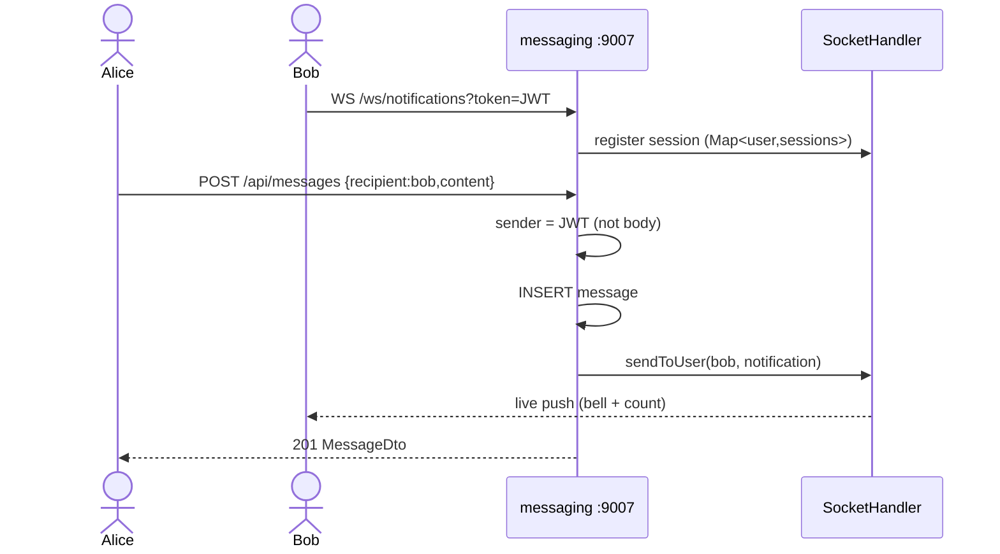
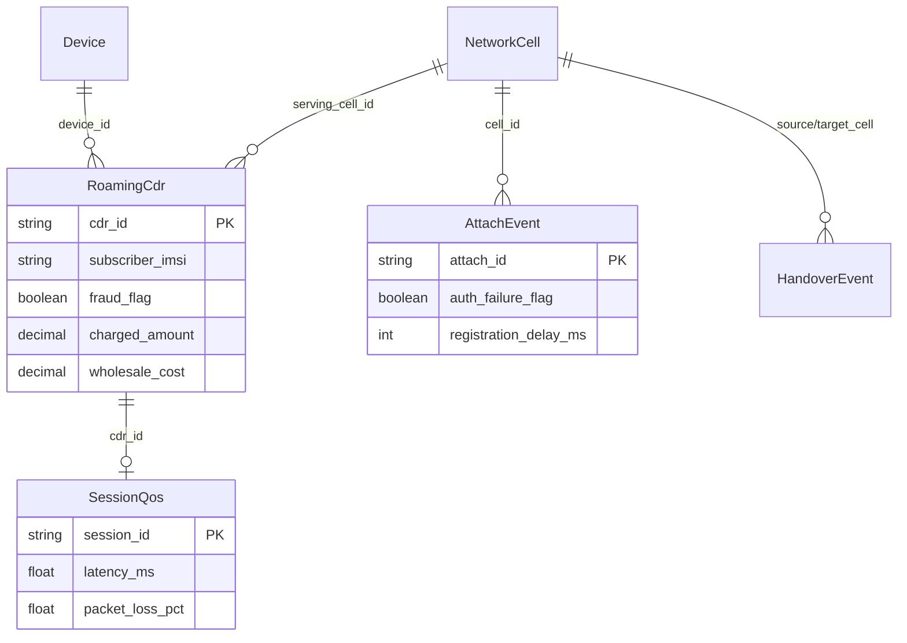

# Nexo Platform — Diagrams (Mermaid mirror)

GitHub renders these inline. They mirror the PlantUML sources in this folder for quick
on-GitHub viewing. For the authoritative, detailed versions render the `.puml` files.

---

## 1. High-level architecture

---

## 2. RBAC — roles → permissions

---

## 3. Login (state-aware) sequence

---

## 4. Protected request (PERM_* authorization)

---

## 5. Messaging + WebSocket notification

---

## 6. Roaming data model (ER)

