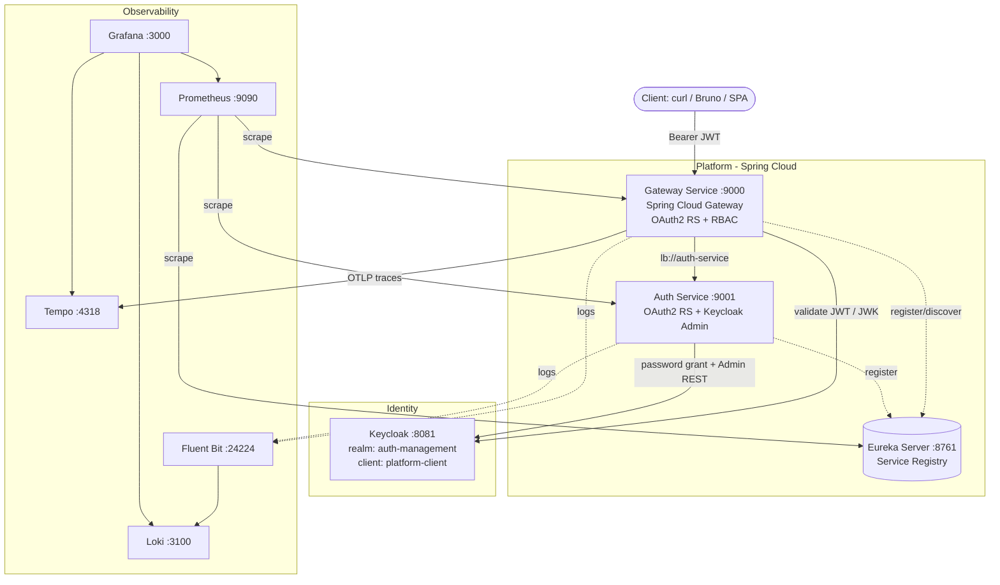
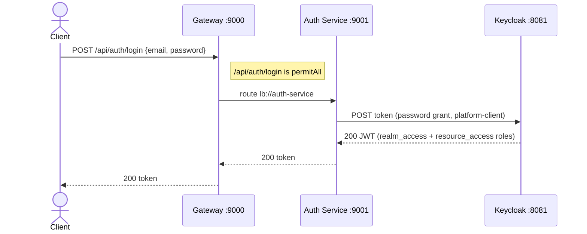
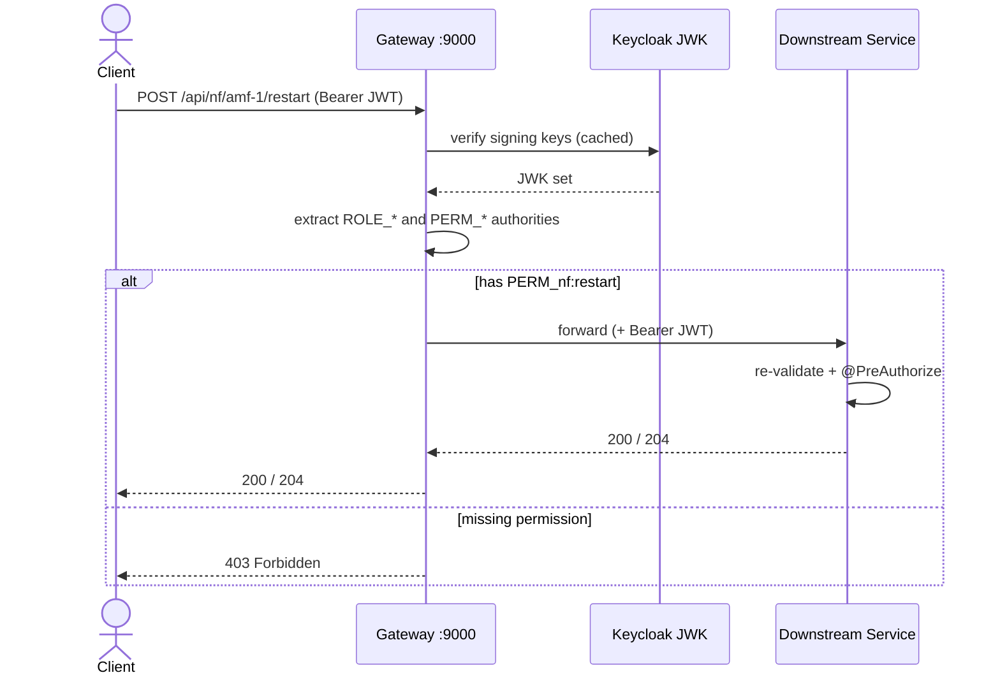
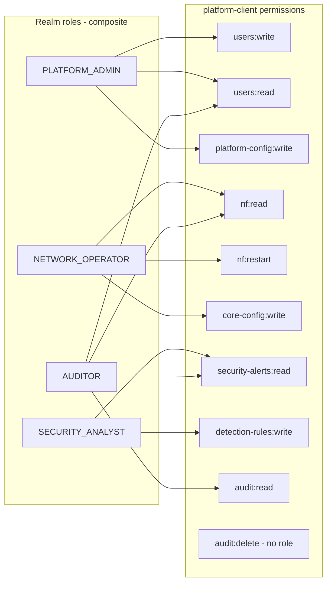
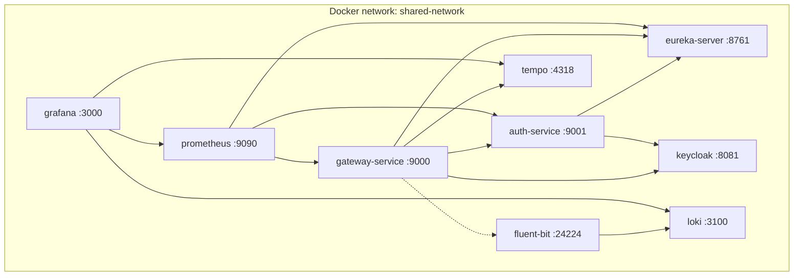

# UML Diagrams (Mermaid)

These mirror the PlantUML files and render directly on GitHub.

## 1. Component / Architecture

## 2. Login sequence

## 3. Protected request (RBAC)

## 4. RBAC model

## 5. Deployment (Docker Compose)

